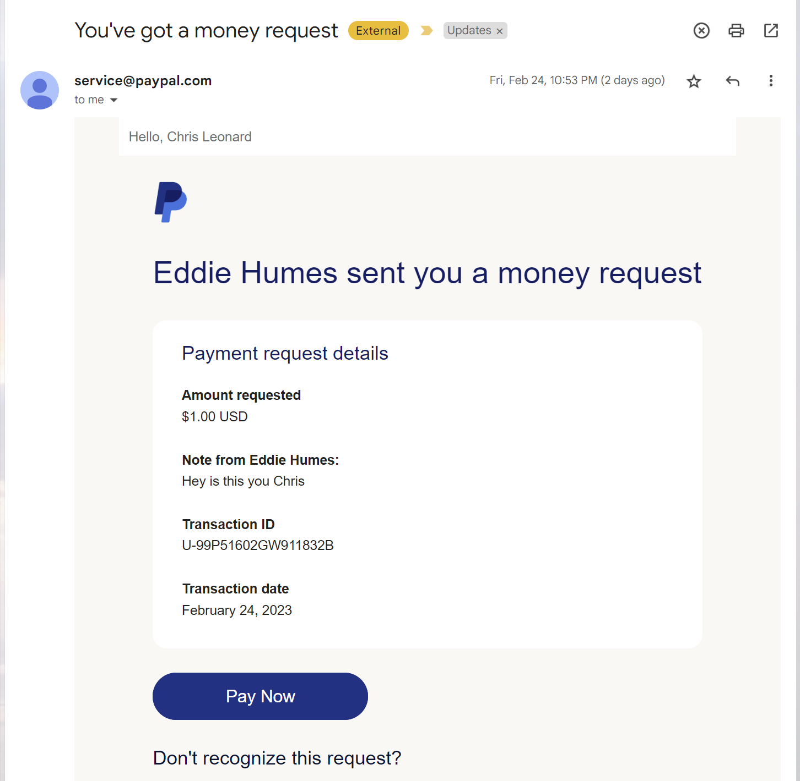

# February 25, 2023 Meeting
<!-- markdownlint-disable MD033 -->
## Agenda

1. A look at a suspicious email
2. DNS: Conclusion
   - Telling your VM which nameserver to use
   - What you need to know about DNS for the competition
   - Why I showed you more about DNS than you need to know
3. A look back at the **How the Internet Works** diagram
   - We just covered DNS
   - We are going to talk about firewalls today
4. Configuring a firewall on our VM
   - Local or shared firewalls?
   - The `ufw` is only `u` if it's the `gufw`
5. Addendum: testing firewalls
   - with ping
   - with telnet
   - with nc

## A look at a suspicious email

Well, to be honest, the email was pretty obviously suspicious. But you folks nailed a lot of important ideas of what to look for in an iffy email. Here's what I remember you pointing out as important things to consider.



- Do you know who the sender is?
- Are they making a weird request?
  - Like (in this email) asking if it's really you, or asking you to send them $1)
- Check the company trademarks to make sure they look right
  - Logos
  - Exact spellings of company name
- Check the links to see if they go to the right domain. But relying on your eyeballs can be tricky. For example:
  - Once at competition, the red team tricked people into visiting `isaege.org`. The correct competition domain is `iseage.org`.
  - Once at a GoDaddy internal conference called **TechFest 2017**, our security team fished people by using an email that included a link to techfest2017@gocladdy.com. Depending on the font used by people's email programs, `cl` next to each other can look a lot like `d`.
  - Letters from other languages can be used to fool people. In the strings `ԁаtаƅаѕеցսу.com` and `databaseguy.com`, the only characters that are the same are `t` and `.com`. Every other character is a look-alike that does not exist in the English alphabet.
- Always go to a website directly rather than clicking on links or buttons embedded in emails.

We discussed that last point in some detail. You should always go to an organization's website in your browser, rather than clicking links in their emails, unless it's painfully obvious that the email is legitimate.

If you cannot figure out how to perform some action that the link or button would perform, either call the organization for assistance, or do whatever is necessary to convince yourself that the email and the link or button are legitimate. If you can't, don't click it right away. Let it sit for a while and let your mind turn it over. Is it worth the risk? You'll probably have a better idea of if it is in a couple of hours rather than deciding "right now." "Right now" is always a time that has urgency associated with it, and bad actors deliberately try to create a sense of pressure to get people to act before they have time to assess situations thoughtfully.

## DNS: Conclusion

### Telling your VM which nameserver to use

Last week, I had trouble getting my VM to change its default DNS server to use the new one I'd just set up. Long story short, I made mistakes.

Usually, a personal computer (desktop or laptop) should have its DNS settings left alone. If it is getting an IP address automatically from a DHCP server, it will almost certainly be assigned appropriate DNS settings by its DHCP server also, if it is left at its default settings.

However, as a point of learning, I wanted to show how to turn this off. This is easy in Windows. Trust me. I can show you if you want.

In Ubuntu 20/22, if you don't want to use automatically-assigned DNS servers, there are at a couple of different ways to make this happen. This will matter at the competition because you will need to point your servers at the DNS servers that the white team provides for you.

There are a few ways to control of the contents of `/etc/resolv.conf`, but the easiest only takes a few steps. This approach relies on the fact that when the system is controlling this file, it is really a link that points to another file. In this case, we can delete the link and create a "real" file and then put whatever contents we want into that file. First, make sure that the current `resolv.conf` is a link.

```bash
# become root:
sudo -i

# check whether /etc/resolv.conf is a link or a regular file:
ls -al /etc/resolv.conf

# the output will look something like this if the file is a link.
# the "l" at the beginning of the line tells you that the file 
# type is "link," and the path at the end of the line shows the
# location of the file that the link points to. These are the
# two ways you can tell that this file is a link to another file.
lrwxrwxrwx 1 root root 39 Feb 18 13:20 /etc/resolv.conf -> ../run/systemd/resolve/stub-resolv.conf

# the output will look something like this if it is a regular
# file. note that the file type (the first character) is "-",
# which means "regular file," and that there no second file
# name at the end of the line. That's how you can tell this
# is a regular file and not a link.
-rw-r--r-- 1 root root 933 Mar  3 23:05 /etc/resolv.conf
```

If `/etc/resolv.conf` is a link, simply delete it and use an editor to create a new file with the same name that contains the IP addresses of the nameservers you want to use. You might also want to include search domains. For example, if the competition gives you a nameserver with the IP address 1.2.3.4, and they give you a domain name of `cdc99.net`, then you could do something like this to set up a permanent `/etc/resolv.conf`:

```bash
# become root:
sudo -i

# delete the link:
rm /etc/resolv.conf

# create a new /etc/resolv.conf:
echo "nameserver 1.2.3.4
search cdc99.net" >> /etc/resolv.conf
```

If you are a sane individual, you will probably want to use a real editor to create the new `/etc/resolv.conf` in the last step, but I needed to do it in a script, and use `echo` to redirect text into a file might not seem fancy, but it works.

### What you need to know about DNS for the competition

Basically, you probably just need to know what the A (address) records are for and how to define them in a Web app.

### Why I showed you more about DNS than you need to know

Hopefully I've told you by now that I don't really "teach to the test." It's not my goal to tell you exactly what you need to know to do well at the competition. My goal is to help you do well in life. If your future life includes any kind of network work or anything "adjacent to" networking (like programming), you should know that DNS is a big deal.

Without it, it's the Internet equivalent of every vehicle in the world running out of fuel at the same time that the whole world runs out of electricity. Stunned, we all try to go next door to talk with our neighbors about what's happening, only to find out that we don't know their address anymore and have no idea where they live.

If DNS breaks, it's an Internet Apocolypse.

## A look back at the <a href="images/How the Internet Works With Background.png">**How the Internet Works**</a> diagram

I have to shorten my comments a little bit, but we got this diagram out for the first time in a while, and noted that we were starting to talk about services that covered more of what was drawn on that diagram. In the interest of getting these notes done, that's all I'm going to say about this tonight.

## Configuring a firewall on our VM

The firewall we will use is `ufw`. This seems to come pre-installed on Ubuntu, but if it's not, you can use `apt` to install it.

### Local or shared firewalls?

You should use a separate, local copy of `ufw` on every server. This is better than running one shared firewall for your network, because it minimizes the risk of a single firewall failing.

### The `ufw` is only `u` if it's the `gufw`

As we saw during our discussion, `gufw` makes `ufw` much more approachable. It can even show you information about what processes are listening for connections currently, and create rules based on those processes, if you ask it to.

Remember that there are three network "profiles" in `ufw`: home, office, and public. For the competition, I'd recommend either a) reading until you really understand how and when `ufw` switches between network profiles; or b) configuring each profile with the same rules.

## Addendum: testing firewalls

After defining firewall rules, you always want to test them and see if they work. If the service you are trying to allow through a firewall is not working, there is a "cheap" test you can run before digging deeper.

### Testing firewalls with `telnet`

That's right, we have a productive use for `telnet`, that most insecure remote access application!

One of the nice things about telnet is that it's really easy to use it to connect to whatever TCP port you want to on another computer. The goal isn't to get a meaningful interaction with the other computer. It's just to check if you get any response at all. Suppose you are trying to setup a firewall rule allowing users to connect to your server, www.acme.com, on port 443. What you can do is run this from another computer that is on the other side of the firewall:

```bash
chris@detroit:~# telnet www.acme.com 443
Trying 23.93.76.124...
Connected to acme.com.
Escape character is '^]'.
^]
telnet> close
Connection closed.
chris@detroit:~#
```

There are a few things I should explain:

- Notice that I put the port number after the name of the computer I'm connecting to when I launched telnet: `telnet www.acme.com 443`.
- Yes, `acme.com` is a apparently a real domain. 443 is the standard port for secure web servers, so I actually got a connection.
- At that point, the test is successful. I have gotten from wherever my computer is running to port 443 on wherever www.acme.com points to. That's what I wanted to check; `telnet` has confirmed that this connection path is physicall open.
- Sometimes you won't get the nice "Connected to yada yada" message. Your screen might go black or something. That's OK. That's still a success.
- A failure is when there is literally no sign of activity from the computer you are trying to telnet to.
  - If this happens, the test has failed.
  - This could mean that the target server is not listening on the port you are targeting.
  - It could also mean that your firewall is not setup correctly, or that other firewalls between your `telnet` client and the server are not allowing the traffic to pass.
- To exit `telnet`:
  - If your connection was successful, `telnet` should have told you that a specific key is an "escape key." It seems like it is usually the two-key combination `Ctrl-]`. Tapping those keys should bring you to a `telnet` prompt, where you type `close` and then `ENTER` to disconnect the session.
  - If your connection was not successful, you may be able to break out of `telnet` using `Ctrl-C`.
